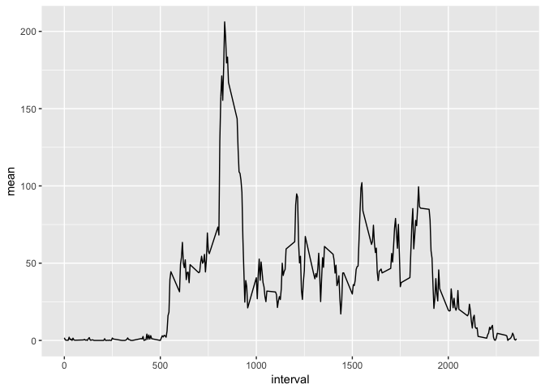
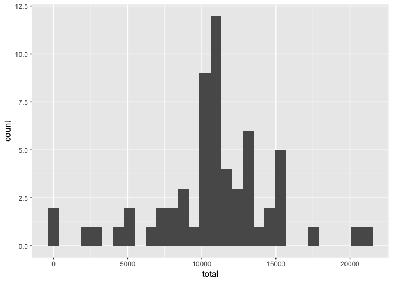
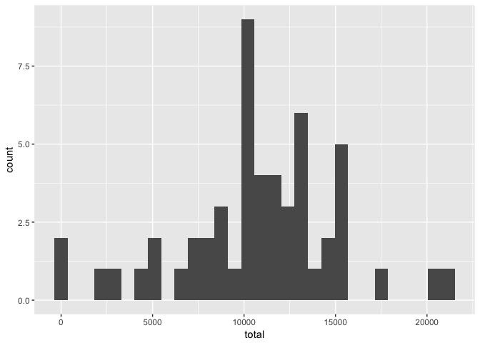
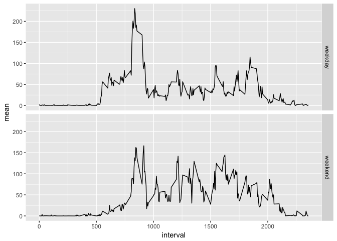

Knitr global settings are set beforehand. `warning` and `message` are set to
FALSE to clean up the output when loading packages or plotting warns about
defaults used.


```r
library(knitr)
opts_chunk$set(warning = FALSE, 
               message = FALSE, 
               fig.path = "figure/")

## Sys.setlocale is used in the final part of the assignment as english
## day names are used.
Sys.setlocale(locale = "en_US.UTF-8")
```

## Loading and preprocessing the data

As data is presented in zipped format, data is first unzipped and read using the
read.csv() function. Finally, the date column is casted from factor to Date.


```r
unzip("activity.zip")
act <- read.csv("activity.csv")

act$date <- as.Date(as.character(act$date), format = "%Y-%m-%d")
```

## What is mean total number of steps taken per day?

1. Make a histogram of the total number of steps taken each day

    Using the dplyr library, data is grouped by date and total steps per day are 
    calculated.

    
    ```r
    library(dplyr)
    sumact <- act %>% 
               group_by(date) %>% 
               summarise(total = sum(steps))
    ```

    Then the histogram is plotted using ggplot2 and geom_histogram.

    
    ```r
    library(ggplot2)
    ggplot(data = sumact, aes(x = total)) +
           geom_histogram()
    ```
    
    <!-- -->

2. Calculate and report the **mean** and **median** total number steps taken per
day

    
    ```r
    mean(sumact$total, na.rm = TRUE)
    ```
    
    ```
    ## [1] 10766.19
    ```
    
    ```r
    median(sumact$total, na.rm = TRUE)
    ```
    
    ```
    ## [1] 10765
    ```

## What is the average daily activity pattern?

1. Make a time series plot (i.e. `type = "l"`) of the 5-minute interval (x-axis)
and the average number of steps taken, averaged across all days (y-axis)

    Activity data is grouped based on interval and the steps mean is calculated
    
    
    ```r
    sumact <- act %>% group_by(interval) %>% 
            summarise(mean = mean(steps, na.rm = TRUE))
    ```

    The plot:

    
    ```r
    ggplot(data = sumact, aes(x = interval, y = mean)) +
            geom_line()
    ```
    
    <!-- -->

2. Which 5-minute interval, on average across all days in the dataset, contains
the maximum number of steps?

    We use `which.max` to find the row with the highest step average and find 
    out which interval it corresponds to.
    
    
    ```r
    sumact[which.max(sumact$mean),]$interval
    ```
    
    ```
    ## [1] 835
    ```

## Imputing missing values

1. Calculate and report the total number of missing values in the dataset (i.e. 
the total number of rows with `NA`s)
    
    The `complete.cases` function will return a logical vector of the
    observations **not** having any `NA`. Negating the logical vector and
    suming it up, will return the number of incomplete cases (rows with `NA`s)
    
    
    ```r
    sum(!complete.cases(act))
    ```
    
    ```
    ## [1] 2304
    ```

2. Devise a strategy for filling in all of the missing values in the dataset. 
The strategy does not need to be sophisticated. For example, you could use the 
mean/median for that day, or the mean for that 5-minute interval, etc.

    First of all, confirm that that the `steps` column is the only one with
    `NA`values:
    
    
    ```r
    sum(is.na(act$steps))
    ```
    
    ```
    ## [1] 2304
    ```
    
    ```r
    sum(is.na(act$date))
    ```
    
    ```
    ## [1] 0
    ```
    
    ```r
    sum(is.na(act$interval))
    ```
    
    ```
    ## [1] 0
    ```


    The `NA`s in steps will be filled with the previously calculated mean for
    that interval.
    
    `act` is the original data and `sumact` the summarized activities grouped by
    `interval`
    
3. Create a new dataset that is equal to the original dataset but with the 
missing data filled in.

    `fact` is assigned `act`, so a new dataset is derived from the original. For
    `fact` the mean for each interval is assigned for each `NA` of each interval
    observation.

    
    ```r
    fact <- act
    
    fact$steps <- ifelse(is.na(fact$steps),
                        sumact[match(act$interval, sumact$interval),]$mean,
                        fact$steps)
    ```

4. Make a histogram of the total number of steps taken each day and Calculate 
and report the **mean** and **median** total number of steps taken per day. Do 
these values differ from the estimates from the first part of the assignment? 
What is the impact of imputing missing data on the estimates of the total daily 
number of steps?

    Using `fact`, with all former `NA` step values set to each interval mean, 
    the data is grouped by date and

    
    ```r
    fsumact <- fact %>% 
               group_by(date) %>% 
               summarise(total = sum(steps))
    ```

    The resulting histogram:

    
    ```r
    ggplot(data = fsumact, aes(x = total)) +
           geom_histogram()
    ```
    
    <!-- -->
    
    That compared with the one on the first part on the assignment, it's clearly
    shown the effect of the `NA` filling just in the middle (the `mean`) of
    the histogram. All the other values in the histogram are kept the same.
    
    
    ```r
    sumact <- act %>% 
              group_by(date) %>% 
              summarise(total = sum(steps))
    ggplot(data = sumact, aes(x = total)) +
           geom_histogram()
    ```
    
    <!-- -->
    
    Looking to median and mean, the data with no `NAs`
    
    
    ```r
    mean(fsumact$total)
    ```
    
    ```
    ## [1] 10766.19
    ```
    
    ```r
    median(fsumact$total)
    ```
    
    ```
    ## [1] 10766.19
    ```

    Comparing the with the ones in the first part:
    
    
    ```r
    mean(sumact$total, na.rm = TRUE)
    ```
    
    ```
    ## [1] 10766.19
    ```
    
    ```r
    median(sumact$total, na.rm = TRUE)
    ```
    
    ```
    ## [1] 10765
    ```
    
    The mean is the same before and after the `NA` filling. Median is also
    made the same per the followed filling strategy.

## Are there differences in activity patterns between weekdays and weekends?


    
1. Create a new factor variable in the dataset with two levels -- "weekday" and 
"weekend" indicating whether a given date is a weekday or weekend day.

    The *filled* activities dataset should include a new column to indicate
    if a given date is a weekday or weekend. As Saturday and Sunday are the
    only days the begin with *S*, it's easy to identify which days correspond
    to weekdays and weekends.
    
    
    ```r
    fact$daytype <- !(grepl("S.+",weekdays(fact$date)))
    fact$daytype <- factor(fact$daytype, 
                           labels = c("weekday", "weekend"), 
                           levels = c(TRUE, FALSE))
    str(fact)
    ```
    
    ```
    ## 'data.frame':	17568 obs. of  4 variables:
    ##  $ steps   : num  1.717 0.3396 0.1321 0.1509 0.0755 ...
    ##  $ date    : Date, format: "2012-10-01" "2012-10-01" ...
    ##  $ interval: int  0 5 10 15 20 25 30 35 40 45 ...
    ##  $ daytype : Factor w/ 2 levels "weekday","weekend": 1 1 1 1 1 1 1 1 1 1 ...
    ```

2. Make a panel plot containing a time series plot (i.e. `type = "l"`) of the 
5-minute interval (x-axis) and the average number of steps taken, averaged 
across all weekday days or weekend days (y-axis).

    
    ```r
    fsumact <- fact %>% group_by(daytype,interval) %>% 
               summarise(mean = mean(steps, na.rm = TRUE))
    ```

    The plot:

    
    ```r
    ggplot(data = fsumact, aes(x = interval, y = mean)) +
            geom_line() + 
            facet_grid(facets = daytype~.)
    ```
    
    <!-- -->

    From the plot, some conclusions can be reached:
    
    * Weekdays have a higher mean peak activity (around 250) than weekends (160)
    * On weekdays, activities begin earlier (around 5:00AM) than on weekends 
    (incrementally growing from 5:00AM to 9:15AM)
    * Although weekdays have a higher mean peak, there's a higher activity mean
    during the day (up to 150) compared to weekdays (around 100-140)
    * During weekends, activity decreases later (peak at 20:00) than weekdays
